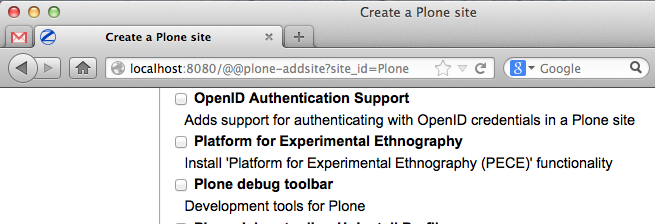
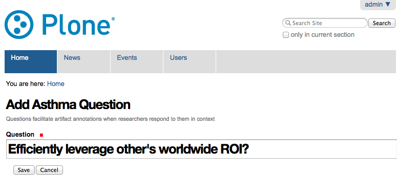

Asthma Files Site
=================

A collective inquiry in to complex conditions. Development sponsored by Rensselaer Polytechnic Institute (RPI).

About
-----

The "Asthma Files Site" add-on for Plone is a research tool, currently in use by RPI but available to anyone doing similar research. It features Dexterity content types and a Collective Cover integration to enable the creation of an "Asthma File": a collectively developed document containing artifacts and annotations.

Installation
------------

To install "Asthma Files Site" functionality on your Plone site, add ``rpi.asthma_files_site`` to your list of Plone "instance eggs" in your ``buildout.cfg`` file. Run Buildout and restart Plone. Create a new Plone site with the add-on selected:

Or add the functionality to an existing site:

.. image:: screenshot2.png

Usage
-----

Follow these steps to begin using the "Asthma Files Site" functionality in your Plone site.

Add a question
--------------

Questions facilitate artifact annotations when researchers respond to them in context. Before you do anything else, add an Asthma Question to your site.

Create an artifact
------------------

An "Asthma File" research document is produced via the assembly of artifacts and annotations. So next, add an Artifact to your site e.g. an "Artifact (Image)".

